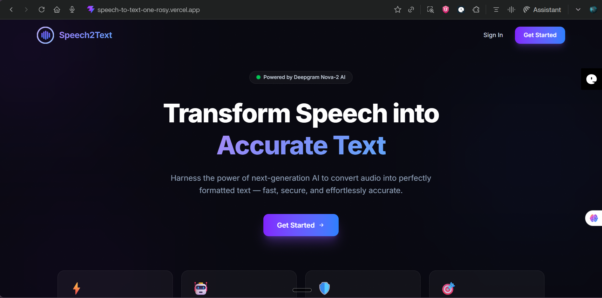
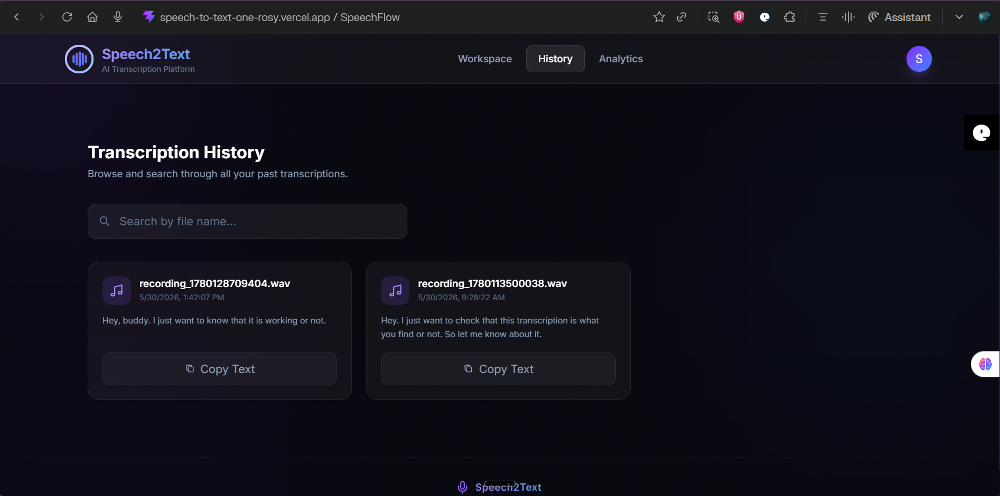

<div align="center">

# 🎙️ Speech2Text

### *Transform Your Voice Into Words — Instantly*

[](https://reactjs.org/)
[](https://nodejs.org/)
[](https://expressjs.com/)
[](https://www.mongodb.com/)
[](https://tailwindcss.com/)
[](https://vitejs.dev/)
[](https://deepgram.com/)
[](https://jwt.io/)
[](https://vercel.com/)
[](https://render.com/)
[](https://opensource.org/licenses/MIT)

<br/>

> **A full-stack MERN web application that converts audio files and live microphone recordings into accurate text transcriptions — powered by the Deepgram AI Speech-to-Text API.**

<br/>

[🌐 Live Demo](https://speech-to-text-one-rosy.vercel.app/dashboard) · [⚙️ Backend API](https://speech-to-text-v0r4.onrender.com/) · [📂 GitHub Repo](https://github.com/SkillMasterShivam/Speech_to_text)

</div>

---

## 📖 Project Overview

**Speech2Text** is a production-ready, full-stack web application that bridges the gap between human speech and machine-readable text. Built with the **MERN stack** (MongoDB, Express.js, React.js, Node.js) and supercharged by the **Deepgram AI API**, it enables users to upload audio files or record directly from their browser microphone and receive high-accuracy transcriptions in seconds.

### 🌍 Why Speech-to-Text?

In a world driven by voice interfaces, accessibility, and productivity automation, speech-to-text technology is indispensable:

- **Accessibility** — Empowers people with disabilities to interact with content more easily
- **Productivity** — Eliminates manual note-taking in meetings, lectures, and interviews
- **Content Creation** — Streamlines podcasting, video captioning, and content repurposing
- **Searchability** — Makes spoken content indexable and searchable

### 🎯 Project Purpose

This project was designed to demonstrate mastery of the complete MERN stack — from designing RESTful APIs and integrating third-party AI services on the backend, to building a polished, responsive UI with React.js on the frontend. It showcases real-world skills: authentication flows, file handling, state management, cloud deployment, and database design.

---

## 🚀 Live Demo

| Resource | URL |
|---|---|
| 🌐 **Frontend (Vercel)** | [https://speech-to-text-one-rosy.vercel.app/dashboard](https://speech-to-text-one-rosy.vercel.app/dashboard) |
| ⚙️ **Backend API (Render)** | [https://speech-to-text-v0r4.onrender.com/](https://speech-to-text-v0r4.onrender.com/) |
| 📂 **GitHub Repository** | [https://github.com/SkillMasterShivam/Speech_to_text](https://github.com/SkillMasterShivam/Speech_to_text) |

> **Note:** The backend is hosted on Render's free tier — it may take **30–60 seconds** to wake up on the first request.

---

## ✨ Features

| Category | Feature |
|---|---|
| 🎤 **Audio Input** | Upload audio files (MP3, WAV, M4A, OGG, FLAC, WebM) |
| 🔴 **Live Recording** | Record audio directly in the browser using the MediaRecorder API |
| 🤖 **AI Transcription** | Powered by Deepgram's state-of-the-art speech-to-text models |
| 🗃️ **Persistent Storage** | All transcriptions stored securely in MongoDB Atlas |
| 📜 **Transcription History** | Browse, search, and manage all past transcriptions |
| 🔒 **Authentication** | Secure JWT-based user registration and login |
| 📋 **Copy to Clipboard** | One-click copy of any transcription result |
| ⬇️ **Download Transcription** | Export transcriptions as plain text files |
| 🔍 **Search History** | Full-text search across transcription history |
| 🗑️ **Delete History** | Remove individual transcriptions from your history |
| 🌙 **Dark Mode** | Toggle between light and dark themes |
| 📱 **Responsive UI** | Fully optimised for mobile, tablet, and desktop screens |

---

## 🛠️ Tech Stack

### 🖥️ Frontend

| Technology | Purpose |
|---|---|
| **React.js (Vite)** | Component-based UI library with lightning-fast HMR via Vite |
| **Tailwind CSS** | Utility-first CSS framework for rapid, responsive styling |
| **React Router DOM** | Client-side routing and protected route navigation |
| **Axios** | Promise-based HTTP client for API communication |
| **MediaRecorder API** | Browser-native API for capturing live microphone audio |

### ⚙️ Backend

| Technology | Purpose |
|---|---|
| **Node.js** | JavaScript runtime environment for server-side logic |
| **Express.js** | Minimal, flexible web application framework |
| **Multer** | Multipart form-data middleware for audio file uploads |
| **Bcrypt.js** | Password hashing with salt rounds for secure storage |
| **jsonwebtoken** | JSON Web Token generation and verification |

### 🗄️ Database

| Technology | Purpose |
|---|---|
| **MongoDB Atlas** | Cloud-hosted NoSQL database |
| **Mongoose** | Elegant MongoDB object modelling with schema validation |

### 🔐 Authentication

| Technology | Purpose |
|---|---|
| **JWT (JSON Web Tokens)** | Stateless, secure token-based authentication |
| **Bcrypt.js** | Industry-standard password hashing |

### 🤖 API Integration

| Technology | Purpose |
|---|---|
| **Deepgram API** | AI-powered speech-to-text transcription engine |

### ☁️ Deployment

| Technology | Purpose |
|---|---|
| **Vercel** | Frontend deployment with automatic CI/CD from GitHub |
| **Render** | Backend deployment with Docker-based infrastructure |
| **MongoDB Atlas** | Managed cloud database cluster |

---

## 🏗️ System Architecture

```
┌─────────────────────────────────────────────────────────────────────┐
│                         CLIENT BROWSER                              │
│                                                                     │
│   ┌─────────────────────────────────────────────────────────────┐   │
│   │                  React.js Frontend (Vite)                   │   │
│   │          Hosted on Vercel · Tailwind CSS · JWT Auth         │   │
│   └─────────────────────────┬───────────────────────────────────┘   │
└─────────────────────────────┼───────────────────────────────────────┘
                              │  HTTPS + FormData / JSON
                              ▼
┌─────────────────────────────────────────────────────────────────────┐
│                    EXPRESS.JS REST API (Node.js)                    │
│                       Hosted on Render.com                          │
│                                                                     │
│   ┌──────────────┐  ┌────────────────┐  ┌────────────────────────┐  │
│   │  Auth Router │  │  Upload Router │  │   Health Router        │  │
│   │  /api/auth   │  │  /api/upload   │  │   /api/health          │  │
│   └──────┬───────┘  └───────┬────────┘  └────────────────────────┘  │
│          │                  │                                        │
│   ┌──────▼───────┐  ┌───────▼────────┐                              │
│   │ JWT Verify   │  │  Multer Upload │                              │
│   │ Middleware   │  │  Middleware    │                              │
│   └──────┬───────┘  └───────┬────────┘                              │
└──────────┼──────────────────┼─────────────────────────────────────-─┘
           │                  │
           ▼                  ▼
┌─────────────────┐  ┌────────────────────────────────────────────────┐
│  MongoDB Atlas  │  │            Deepgram AI API                     │
│  (Cloud NoSQL)  │◄─┤   POST audio buffer → returns transcript JSON  │
│                 │  │                                                │
│  ┌───────────┐  │  └────────────────────────────────────────────────┘
│  │   Users   │  │
│  ├───────────┤  │
│  │Transcripts│  │
│  └───────────┘  │
└─────────────────┘
```

**Data Flow Summary:**
```
User (Browser) ──► React Frontend ──► Express Backend ──► Deepgram API
                                            │                    │
                                            ▼                    │
                                      MongoDB Atlas ◄────────────┘
                                            │
                                            ▼
                                    React Frontend (Display)
```

---

## 🔄 Project Workflow

```
┌────────────────────────────────────────────────────────────────────┐
│  STEP 1: Authentication                                            │
│  User registers / logs in → JWT token issued → stored client-side  │
└─────────────────────────────────┬──────────────────────────────────┘
                                  │
                                  ▼
┌────────────────────────────────────────────────────────────────────┐
│  STEP 2: Audio Input                                               │
│  User uploads an audio file   ──OR──  Records via microphone       │
│  (MP3, WAV, M4A, OGG, FLAC, WebM)     (MediaRecorder API → Blob)  │
└─────────────────────────────────┬──────────────────────────────────┘
                                  │
                                  ▼
┌────────────────────────────────────────────────────────────────────┐
│  STEP 3: Upload to Backend                                         │
│  FormData with audio + JWT Bearer token sent to POST /api/upload/  │
│  audio. Multer middleware handles multipart/form-data parsing.     │
└─────────────────────────────────┬──────────────────────────────────┘
                                  │
                                  ▼
┌────────────────────────────────────────────────────────────────────┐
│  STEP 4: Deepgram Transcription                                    │
│  Server streams audio buffer to Deepgram REST API → receives JSON  │
│  response with full transcript text and confidence scores.         │
└─────────────────────────────────┬──────────────────────────────────┘
                                  │
                                  ▼
┌────────────────────────────────────────────────────────────────────┐
│  STEP 5: Persist to Database                                       │
│  Transcription document saved in MongoDB Atlas with userId,        │
│  filename, mimeType, size, and transcriptionText fields.           │
└─────────────────────────────────┬──────────────────────────────────┘
                                  │
                                  ▼
┌────────────────────────────────────────────────────────────────────┐
│  STEP 6: Display Result                                            │
│  Frontend renders transcription text. User can Copy, Download,     │
│  or browse full transcription history with search & delete.        │
└────────────────────────────────────────────────────────────────────┘
```

---

## 📁 Folder Structure

```
Speech_to_text/
│
├── 📄 README.md
├── 📄 .gitignore
├── 📄 render.yaml                     # Render deployment configuration
│
├── 📂 client/                         # React Frontend (Vite)
│   ├── 📄 index.html
│   ├── 📄 vite.config.js
│   ├── 📄 vercel.json                 # Vercel deployment config & rewrites
│   ├── 📄 package.json
│   ├── 📄 .env.example
│   ├── 📂 public/
│   └── 📂 src/
│       ├── 📄 main.jsx                # App entry point
│       ├── 📄 App.jsx                 # Root component & routing
│       ├── 📄 index.css               # Global styles
│       ├── 📂 pages/                  # Page-level components
│       │   ├── 📄 Login.jsx
│       │   ├── 📄 Register.jsx
│       │   └── 📄 Dashboard.jsx
│       ├── 📂 components/             # Reusable UI components
│       │   ├── 📄 AudioUploader.jsx
│       │   ├── 📄 AudioRecorder.jsx
│       │   ├── 📄 TranscriptionResult.jsx
│       │   └── 📄 HistoryList.jsx
│       ├── 📂 features/               # Feature-specific logic (Redux slices)
│       ├── 📂 layouts/                # Layout wrappers (ProtectedLayout, etc.)
│       ├── 📂 services/               # Axios API service modules
│       └── 📂 constants/              # App-wide constants & config
│
└── 📂 server/                         # Express Backend (Node.js)
    ├── 📄 server.js                   # HTTP server bootstrap
    ├── 📄 app.js                      # Express app config & middleware
    ├── 📄 package.json
    ├── 📄 .env.example
    ├── 📂 config/                     # DB connection & app config
    │   └── 📄 db.js
    ├── 📂 routes/                     # Express route definitions
    │   ├── 📄 authRoutes.js
    │   ├── 📄 uploadRoutes.js
    │   └── 📄 healthRoutes.js
    ├── 📂 controllers/                # Route handler functions
    │   ├── 📄 authController.js
    │   └── 📄 uploadController.js
    ├── 📂 middleware/                 # Custom middleware
    │   ├── 📄 verifyJWT.js
    │   ├── 📄 uploadMiddleware.js
    │   └── 📄 asyncHandler.js
    ├── 📂 models/                     # Mongoose data models
    │   ├── 📄 User.js
    │   └── 📄 Transcription.js
    ├── 📂 services/                   # Business logic / third-party services
    │   └── 📄 deepgramService.js
    ├── 📂 utils/                      # Helper utilities
    └── 📂 uploads/                    # Temporary audio file storage
```

---

## ⚙️ Installation & Local Setup

### Prerequisites

Before you begin, ensure you have the following installed:

- **Node.js** v18+ — [Download](https://nodejs.org/)
- **npm** v9+ (comes with Node.js)
- **MongoDB Atlas** account — [Sign up free](https://www.mongodb.com/atlas)
- **Deepgram API Key** — [Get one free](https://console.deepgram.com/)
- **Git** — [Download](https://git-scm.com/)

---

### 1️⃣ Clone the Repository

```bash
git clone https://github.com/SkillMasterShivam/Speech_to_text.git
cd Speech_to_text
```

---

### 2️⃣ Setup the Backend (Server)

```bash
# Navigate to the server directory
cd server

# Install dependencies
npm install

# Create your environment file
cp .env.example .env
```

Open `.env` and fill in your credentials (see [Environment Variables](#-environment-variables) section).

```bash
# Start the backend development server
npm run dev
```

> The backend will start on **http://localhost:5000**

---

### 3️⃣ Setup the Frontend (Client)

Open a **new terminal tab/window**:

```bash
# Navigate to the client directory
cd client

# Install dependencies
npm install

# Create your environment file
cp .env.example .env
```

Open `.env` and fill in your API base URL (see [Environment Variables](#-environment-variables) section).

```bash
# Start the frontend development server
npm run dev
```

> The frontend will start on **http://localhost:5173**

---

## 🔐 Environment Variables

### Backend — `server/.env`

```env
# ─── Server ───────────────────────────────────────────────────
PORT=5000
NODE_ENV=development

# ─── Client Origin (for CORS) ─────────────────────────────────
CLIENT_URL=http://localhost:5173

# ─── MongoDB Atlas ────────────────────────────────────────────
MONGO_URI=mongodb+srv://<username>:<password>@cluster0.xxxxx.mongodb.net/<dbname>?retryWrites=true&w=majority

# ─── Deepgram Speech-to-Text ──────────────────────────────────
DEEPGRAM_API_KEY=your_deepgram_api_key_here

# ─── JSON Web Token ───────────────────────────────────────────
JWT_SECRET=your_super_secret_jwt_key_minimum_32_characters
JWT_EXPIRES_IN=30d
```

### Frontend — `client/.env`

```env
# ─── Backend API Base URL (no trailing slash) ─────────────────
VITE_API_BASE_URL=http://localhost:5000/api
```

> **For production** on Vercel, set `VITE_API_BASE_URL=https://speech-to-text-v0r4.onrender.com/api`

---

## 📡 API Endpoints

Base URL: `https://speech-to-text-v0r4.onrender.com/api`

### 🔒 Authentication — `/api/auth`

| Method | Endpoint | Auth Required | Description |
|---|---|---|---|
| `POST` | `/api/auth/register` | ❌ | Register a new user account |
| `POST` | `/api/auth/login` | ❌ | Login and receive JWT token |
| `GET` | `/api/auth/me` | ✅ Bearer | Get current authenticated user info |

**Register — Request Body:**
```json
{
  "name": "Shivam Chaudhary",
  "email": "shivam@example.com",
  "password": "yourpassword"
}
```

**Login — Request Body:**
```json
{
  "email": "shivam@example.com",
  "password": "yourpassword"
}
```

**Login — Response:**
```json
{
  "success": true,
  "token": "eyJhbGciOiJIUzI1NiIsInR5cCI6IkpXVCJ9...",
  "user": {
    "_id": "64abc123...",
    "name": "Shivam Chaudhary",
    "email": "shivam@example.com",
    "role": "user"
  }
}
```

---

### 🎤 Audio Upload & Transcription — `/api/upload`

| Method | Endpoint | Auth Required | Description |
|---|---|---|---|
| `POST` | `/api/upload/audio` | ✅ Bearer | Upload audio file or recording blob for transcription |
| `GET` | `/api/upload/history` | ✅ Bearer | Retrieve all transcriptions for the logged-in user |
| `GET` | `/api/upload/history/:id` | ✅ Bearer | Retrieve a single transcription by its ID |

**Upload Audio — Request:**

> Content-Type: `multipart/form-data`

| Field | Type | Description |
|---|---|---|
| `audio` | `File/Blob` | Audio file (MP3, WAV, M4A, OGG, FLAC, WebM) |

**Upload Audio — Response:**
```json
{
  "success": true,
  "data": {
    "_id": "64def456...",
    "userId": "64abc123...",
    "originalFileName": "meeting_notes.mp3",
    "mimeType": "audio/mpeg",
    "size": 204800,
    "transcriptionText": "Hello, this is the transcribed text from the audio file.",
    "createdAt": "2025-05-30T08:00:00.000Z"
  }
}
```

---

### 🗑️ Delete Transcription

| Method | Endpoint | Auth Required | Description |
|---|---|---|---|
| `DELETE` | `/api/upload/history/:id` | ✅ Bearer | Delete a specific transcription record |

---

### 💓 Health Check — `/api/health`

| Method | Endpoint | Auth Required | Description |
|---|---|---|---|
| `GET` | `/api/health` | ❌ | Server and database health status check |

---

## 🗃️ Database Design

### 📌 User Collection — `users`

```javascript
{
  _id:       ObjectId,          // Auto-generated unique ID
  name:      String,            // User's full name (2–50 chars, required)
  email:     String,            // Unique email address (lowercase, validated)
  password:  String,            // Bcrypt-hashed password (select: false)
  role:      String,            // "user" | "admin" (default: "user")
  createdAt: Date,              // Auto (Mongoose timestamps)
  updatedAt: Date               // Auto (Mongoose timestamps)
}
```

**Constraints:**
- `email` has a unique index enforced at the database level
- `password` is excluded from query results by default (`select: false`)
- Password is hashed with bcrypt using 12 salt rounds via a `pre-save` hook

---

### 📌 Transcription Collection — `transcriptions`

```javascript
{
  _id:               ObjectId,  // Auto-generated unique ID
  userId:            ObjectId,  // Reference → users._id (required)
  originalFileName:  String,    // Original uploaded file name (trimmed)
  fileName:          String,    // Sanitised server-side file name
  audioFilePath:     String,    // Server filesystem path (nullable)
  mimeType:          String,    // MIME type e.g. "audio/mpeg" (required)
  size:              Number,    // File size in bytes (required)
  transcriptionText: String,    // Full transcribed text from Deepgram (required)
  createdAt:         Date       // Timestamp (default: Date.now)
}
```

**Indexes:**
- **Compound index** on `{ userId: 1, createdAt: -1 }` for efficient history queries sorted by newest-first per user

---

## 📸 Screenshots

### Login Page
> 

---

### Dashboard
> 

---

### Upload Audio
> 

---

### Recording Audio
> 

---

### Transcription Result
> 

---

### History Section
> 

---

## 🔒 Security Features

| Feature | Implementation |
|---|---|
| **JWT Authentication** | All protected routes require a valid `Bearer` token in the `Authorization` header. Tokens expire after 30 days. |
| **Password Hashing** | User passwords are hashed with `bcrypt` using 12 salt rounds before being stored. Plain-text passwords are never persisted. |
| **Protected Routes** | Server-side `verifyJWT` middleware guards all private API endpoints. Frontend uses protected route wrappers to prevent unauthorised access. |
| **Input Validation** | Mongoose schema validators enforce field types, lengths, formats (email regex), and required constraints at the model layer. |
| **Secure API Calls** | HTTPS enforced on all deployed endpoints. CORS configured with an explicit `CLIENT_URL` allowlist. |
| **Password Exclusion** | The `password` field has `select: false` on the Mongoose schema, preventing it from being accidentally returned in any query response. |

---

## 🚀 Future Enhancements

| # | Enhancement | Description |
|---|---|---|
| 🌍 | **Multi-language Support** | Add language selection for transcription to support Spanish, French, Hindi, and more via Deepgram's language models |
| 🗣️ | **Speaker Identification** | Diarise audio to identify and label different speakers within a single recording |
| 📄 | **Export to PDF** | Allow users to download transcription results as formatted PDF documents |
| ⚡ | **Real-time Transcription** | Implement WebSocket-based streaming for live transcription as the user speaks |
| 🤖 | **AI Summarisation** | Integrate an LLM (e.g., GPT-4o) to auto-generate concise summaries of long transcriptions |
| 🏷️ | **Tags & Categories** | Allow users to organise transcriptions with custom tags for better history management |
| 🔗 | **Public Sharing Links** | Generate shareable read-only links for individual transcriptions |
| 📊 | **Usage Analytics Dashboard** | Display statistics such as total audio processed, word count, and monthly usage trends |

---

## ⚡ Challenges Faced

### 1. 🌐 CORS Configuration in Production
Configuring CORS between Vercel (frontend) and Render (backend) required careful `CLIENT_URL` whitelisting and proper `credentials: true` settings. Mismatches between environment variables on each platform caused silent authentication failures.

### 2. 🎙️ Browser MediaRecorder API Inconsistencies
Different browsers produce different MIME types from the MediaRecorder API (e.g., `audio/webm` on Chrome, `audio/ogg` on Firefox). Normalising blob formats before sending to the backend required thorough cross-browser testing.

### 3. ⏱️ Render Cold Start Latency
Render's free tier spins down idle containers, causing 30–60 second cold start delays. Managing this UX issue required implementing a health-check ping and appropriate loading states on the frontend.

### 4. 📁 Multer File Handling for Blobs
Handling both named file uploads and raw audio blobs from browser recordings via Multer required custom filename generation logic to ensure consistent storage and retrieval.

### 5. 🔐 JWT Token Persistence & Expiry
Implementing secure token storage (localStorage vs. httpOnly cookies), handling token expiry gracefully, and redirecting users to login without disrupting the UI required careful state management.

### 6. 🤖 Deepgram API Rate Limits & Error Handling
Building resilient error handling around the Deepgram API — including network failures, unsupported audio formats, and API quota errors — was critical to delivering a smooth user experience.

---

## 📚 Learning Outcomes

### 🧱 Full-Stack MERN Development
Built an end-to-end production application with React.js on the frontend and Node.js + Express.js on the backend, mastering component architecture, REST API design, and client-server communication.

### 🤖 Third-Party API Integration
Gained hands-on experience integrating the **Deepgram Speech-to-Text API**, including authentication, request formatting, streaming audio buffers, and parsing AI-generated JSON responses.

### 🔐 Authentication & Security
Implemented a complete **JWT-based auth system** including registration, login, token verification middleware, protected routes, bcrypt password hashing, and secure CORS configuration.

### ☁️ Cloud Deployment & DevOps
Deployed a full-stack application with environment-specific configurations across **Vercel** (frontend), **Render** (backend), and **MongoDB Atlas** (database). Managed environment variables and CI/CD pipelines.

### 🗄️ Database Design & Management
Designed **Mongoose schemas** with validation, indexing strategies, and relational references between collections. Gained experience with compound indexes to optimise query performance.

### 🎙️ Browser Media APIs
Leveraged the browser-native **MediaRecorder API** to capture microphone audio, convert it to blobs, and transmit it as multipart form data — bridging browser APIs with server-side file processing.

### 📱 Responsive UI Design
Built a fully responsive, mobile-first UI with **Tailwind CSS**, implementing dark mode, smooth animations, and an accessible component structure suitable for all screen sizes.

---

## 👨‍💻 Author

<div align="center">

### Shivam Chaudhary

**B.Tech Computer Science Engineering (AI & ML)**

*Project: Speech2Text — MERN Stack Speech-to-Text Web Application*

[](https://github.com/SkillMasterShivam)

> *"The best way to learn full-stack development is to build something real, deploy it to production, and solve the problems that only production can throw at you."*

</div>

---

## 📄 License

```
MIT License

Copyright (c) 2025 Shivam Chaudhary

Permission is hereby granted, free of charge, to any person obtaining a copy
of this software and associated documentation files (the "Software"), to deal
in the Software without restriction, including without limitation the rights
to use, copy, modify, merge, publish, distribute, sublicense, and/or sell
copies of the Software, and to permit persons to whom the Software is
furnished to do so, subject to the following conditions:

The above copyright notice and this permission notice shall be included in all
copies or substantial portions of the Software.

THE SOFTWARE IS PROVIDED "AS IS", WITHOUT WARRANTY OF ANY KIND, EXPRESS OR
IMPLIED, INCLUDING BUT NOT LIMITED TO THE WARRANTIES OF MERCHANTABILITY,
FITNESS FOR A PARTICULAR PURPOSE AND NONINFRINGEMENT. IN NO EVENT SHALL THE
AUTHORS OR COPYRIGHT HOLDERS BE LIABLE FOR ANY CLAIM, DAMAGES OR OTHER
LIABILITY, WHETHER IN AN ACTION OF CONTRACT, TORT OR OTHERWISE, ARISING FROM,
OUT OF OR IN CONNECTION WITH THE SOFTWARE OR THE USE OR OTHER DEALINGS IN THE
SOFTWARE.
```

---

<div align="center">

**⭐ If you found this project useful, please consider giving it a star on GitHub!**

Made with ❤️ by [Shivam Chaudhary](https://github.com/SkillMasterShivam)

[](https://github.com/SkillMasterShivam/Speech_to_text/stargazers)
[](https://github.com/SkillMasterShivam/Speech_to_text/network/members)

</div>
